# latent_scalar_sim: Encoding After Feedback, and What Gets Stored (NFL example)

_Part of `ti-models`. Folder: `latent_scalar_sim/` → `figures/`, `results/`, `simulation/` + `run_nfl.py`._
_Results below are from v2 (16 teams, 10 weeks, seed 7 + 300 replicated seasons)._

> **Two kinds of figures appear below.** *Concept figures* (C1–C7) are schematics or closed-form/toy illustrations made by `make_concept_figures.py`. They explain an equation or an idea, and none of them is a simulation result. *Result figures* (R1–R9) come from `run_nfl.py`.

| | Figure | Section |
|---|---|---|
| C1 | Encoding vs. retrieval: where the inference happens | 1.1 |
| C2 | The world: true strengths and the logistic link | 2.1 |
| R1 | Results matrix (who played whom, who won) | 2.1 |
| C3 | Elo and BT are one curve on two scales | 2.4 |
| R2 | Ratings on one Elo scale | 2.4 |
| C4 | One new game: local (Elo) vs. global (BT) update | 4 |
| R3 | Symbolic distance, played vs. never-played pairs | 3.1 |
| R4 | Ranking bump chart | 3.2 |
| R5 | Learning curves | 3.2 |
| R6 | Week-by-week rating trajectories | 3.3 |
| C5 | Why K = 20 compresses Elo | 3.3 |
| R7 | Probability matrices | 3.3 |
| R8 | Calibration | 3.4 |
| C6 | Shrinkage: two calibration views | 3.4 |
| R9 | Week-11 test | 3.5 |
| C7 | Timing × content | 5 |

---

## 0. Why this simulation exists

The NFL sandbox is not a model of transitive inference in people. It is a controlled world where the answer is known, used to see what two latent-scalar learners actually do when they are given exactly the kind of world they assume.

It is useful for the repo because it pulls apart two questions that the TI literature often runs together:

1. **When is the inference computed?** At encoding (the representation is updated after each piece of feedback, and a judgment is a readout) or at retrieval (stored episodes are combined online when the judgment is made).
2. **What is stored?** A scalar per item, a distribution over a scalar, a graph or map, or a set of conjunctive pair memories.

These are separate axes. A model can sit anywhere on one without that fixing its position on the other. Bradley–Terry and Elo happen to agree on both: both are encoding-based, and both store a scalar. That agreement is what makes the simulation clean. Any difference between them has to come from something *inside* "encoding-based scalar," which Section 4 argues is **what is kept between feedback events and how much of the store is revised when feedback arrives.**

---

## 1. Axis 1: encoding after feedback vs. retrieval

Following the repo's mechanistic split:

- **Encoding-based:** structure is built during learning and read out at test.
- **Retrieval-based:** relations are chained together online at judgment time.

### 1.1 How BT and Elo are encoding-based

In both models the learning event is the **outcome of a game**. The outcome produces a prediction error, the error changes the stored ratings, and nothing else happens until the next outcome. At judgment time, including the week-11 test on never-played pairs, the only computation is

$$
\hat P(i \text{ beats } j) = \sigma(\hat v_i - \hat v_j).
$$

No games are looked up, and no chain of opponents (i beat k, k beat j) is assembled. The inference for a pair that never met is available **before the question is asked**, because placing every team on one axis during learning already fixed where each team stands relative to every other. That is the sense in which the inference is "done at encoding."

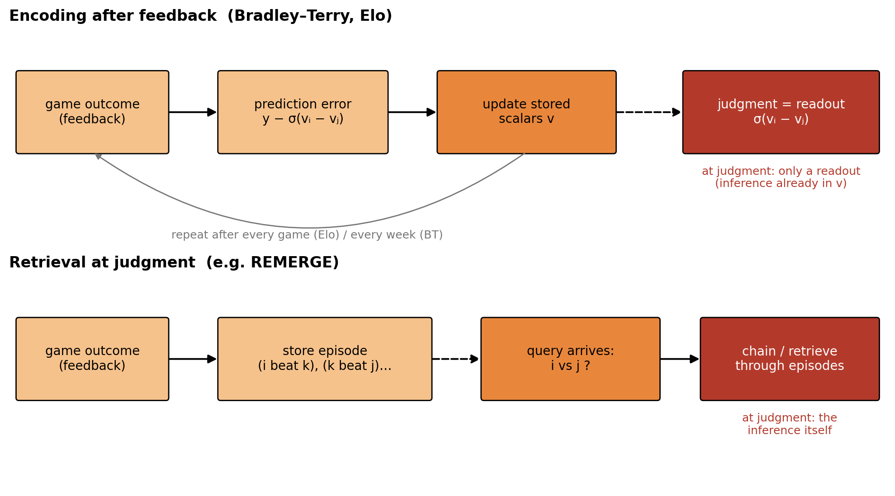

*C1. The two rows receive the same feedback. What differs is where the work happens. Under encoding (top), each outcome updates the stored scalars, and a judgment is only a readout. Under retrieval (bottom), outcomes are stored as episodes, and the inference is assembled when the question arrives. The dashed arrow marks the gap between learning and test.*

### 1.2 What the symbolic distance effect does and doesn't tell us here

Both models produce a clean distance effect on never-played pairs (Section 3.1). In a scalar model this falls straight out of the readout: larger rank gaps mean larger $\hat v_i - \hat v_j$, which means $\sigma(\cdot)$ is closer to 1.

This is **consistent with** encoding, but it is not **evidence for** encoding over retrieval. Retrieval models such as REMERGE also produce distance effects, by a different route. The chain condition in the prediction matrix already flags this: all accounts agree. The simulation shows what the encoding version of the effect looks like when the generating world is known. It does not show that the effect requires encoding.

---

## 2. The conceptual models and their ranking equations

### 2.1 The world (generative model)

Sixteen teams with evenly spaced true strengths. The listed order is the hidden true hierarchy (NE strongest, CLE weakest):

$$
s_k = 1.5 - 0.2\,k, \qquad k = 0, \dots, 15 \quad (\text{spread } 3.0 \text{ logits})
$$

$$
P(i \text{ beats } j) = \sigma(s_i - s_j) = \frac{1}{1 + e^{-(s_i - s_j)}}
$$

Adjacent teams: $\sigma(0.2) \approx 0.55$. Best vs. an average team: $\sigma(1.5) \approx 0.82$.

Schedule: 10 weeks × 8 games, random pairings with no rematches, binary W/L only (no margins, conferences, or playoffs). Week 11 draws its 8 games only from the 40 pairs that never met.

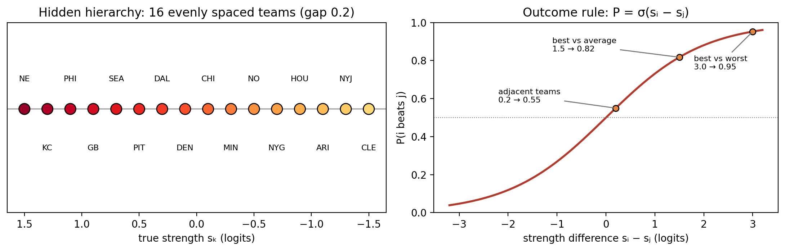

*C2. Left: the hidden hierarchy, 16 teams 0.2 logits apart. Right: the outcome rule. Adjacent teams are close to a coin flip (0.55), which is why neighboring pairs are the hardest to order from 10 games.*

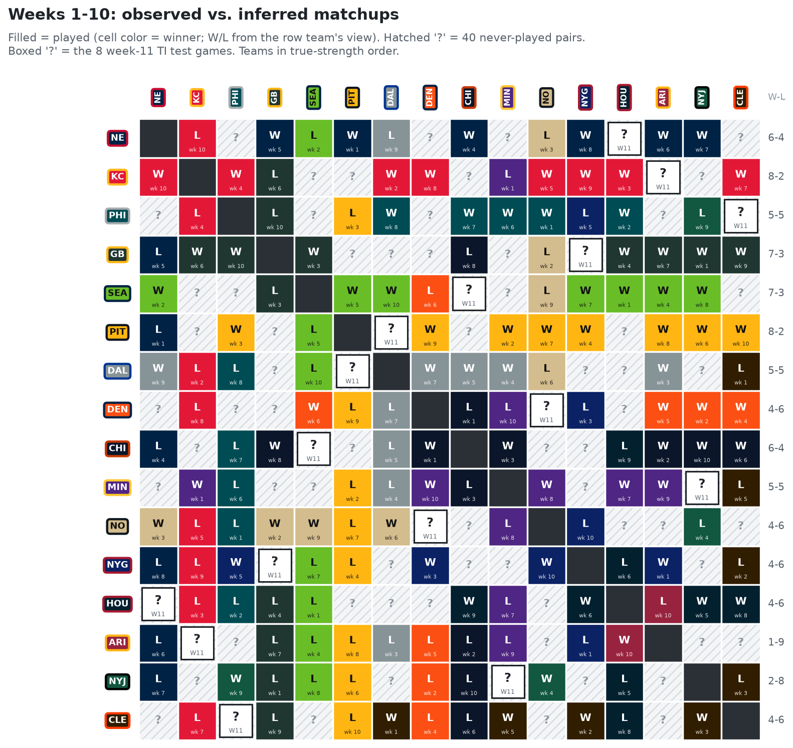

*R1. Season results (seed 7). Blank cells are the 40 never-played pairs that week 11 draws from. **What to look at:** the matrix is sparse, since each team meets only 10 of its 15 possible opponents. Every never-played pair has to be inferred.*

Both learners assume exactly this form, so they are **correctly specified**. The comparison is batch vs. online estimation of the same likelihood, not a comparison of two theories of the world.

### 2.2 Baseline: win–loss record

$$
r_i = \frac{W_i}{W_i + L_i}, \qquad \text{rank by } r_i
$$

This has no parameters, no pairwise probabilities, and no use of who a team played. It is the "count the wins" floor: any gain a model shows in ordering has to beat this.

### 2.3 Bradley–Terry (MAP, batch)

The stored quantity after refitting is a latent value $v_k$ per team. It is refit at the end of every week on **all games played so far** ($y_{g} = 1$ if the listed team won game $g$):

$$
\ell(\mathbf v) = \sum_{g=(i,j)} \Big[ y_g \log \sigma(v_i - v_j) + (1 - y_g)\log \sigma(v_j - v_i) \Big] \;-\; \sum_k \frac{v_k^2}{2\tau^2}, \qquad \tau = 1.0
$$

Gradient and Hessian for the Newton steps:

$$
\frac{\partial \ell}{\partial v_k} = \sum_{g \ni k} \big(y_{k,g} - \sigma(v_k - v_{\text{opp}(g)})\big) - \frac{v_k}{\tau^2}
$$

$$
\mathbf H = -\sum_{g=(i,j)} p_g(1-p_g)\,(\mathbf e_i - \mathbf e_j)(\mathbf e_i - \mathbf e_j)^\top - \frac{1}{\tau^2}\mathbf I, \qquad p_g = \sigma(v_i - v_j)
$$

$$
\mathbf v \leftarrow \mathbf v - \mathbf H^{-1}\nabla \ell \quad \text{(iterate to convergence)}
$$

Uncertainty comes from the Laplace approximation, $\mathrm{SE}(\hat v_k) = \sqrt{[(-\mathbf H)^{-1}]_{kk}}$. Teams are ranked by $\hat v_k$, and pairs are predicted by $\sigma(\hat v_i - \hat v_j)$.

The prior does two jobs. It gives a finite solution when a team is unbeaten or winless (without it the maximum-likelihood value would go to $\pm\infty$), and it shrinks every estimate toward 0. The second job matters for the calibration result in 3.4.

### 2.4 Elo (online)

The stored quantity is a rating $R_k$ per team, starting at 1500. It is updated after **each game**, and only for the two teams in that game:

$$
E_i = \frac{1}{1 + 10^{(R_j - R_i)/400}}
$$

$$
R_i \leftarrow R_i + K\,(y - E_i), \qquad R_j \leftarrow R_j - K\,(y - E_i), \qquad K = 20
$$

No margin-of-victory term is used. An optional multi-pass mode replays the season's games repeatedly. Teams are ranked by $R_k$.

**Same model, different estimator.** Since $10^{x/400} = e^{x \ln 10 / 400}$, Elo's expected score is Bradley–Terry's $\sigma(v_i - v_j)$ with

$$
v = \frac{\ln 10}{400}\,(R - 1500) \quad\Longleftrightarrow\quad R = 1500 + \frac{400}{\ln 10}\, v \approx 1500 + 173.7\,v.
$$

That identity is what lets the ratings figure put both models on one Elo scale.

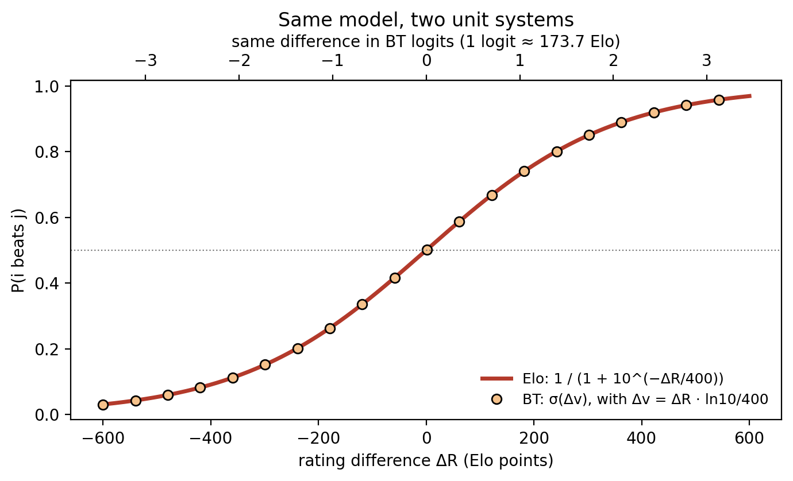

*C3. The Elo expected-score formula (line) and the BT logistic (points) coincide once the axis is rescaled by 400/ln 10. The two models share one likelihood and differ only in how they estimate it.*

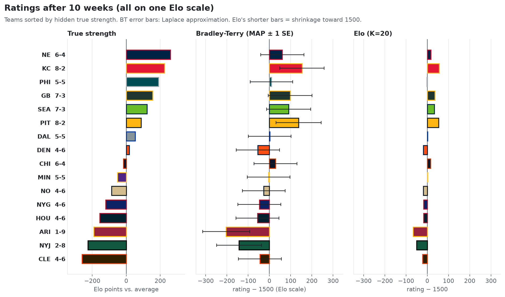

*R2. Week-10 ratings from both models on the Elo scale. **What to look at:** Elo's ratings should be packed more tightly around 1500 than BT's. That spacing is the confidence difference in 3.3, visible before any probabilities are computed.*
 The Elo update is one stochastic gradient step on the BT log-likelihood for a single game, with an effective learning rate in logit units of

$$
\eta = K \cdot \frac{\ln 10}{400} \approx 0.115 \text{ logits per unit prediction error.}
$$

### 2.5 Summary

| Model | Stored between feedback events | Update trigger | Scope of update | Readout at judgment |
|---|---|---|---|---|
| Win–loss record | W and L counts | each game | the two teams | rank only, no pair probability |
| Bradley–Terry | full game history → $\hat{\mathbf v}$ | end of each week | **all teams** (global refit) | $\sigma(\hat v_i - \hat v_j)$ |
| Elo | $\mathbf R$ only | each game | **the two teams** (local step) | $\sigma$ on the Elo scale |

---

## 3. What the results showed

### 3.1 Both show a clean distance effect on never-played pairs

Accuracy on never-played pairs climbs from about 55% at rank distance 1 to about 100% at distance 12 and beyond, for both models. Section 1.2 covers what this does and does not license.

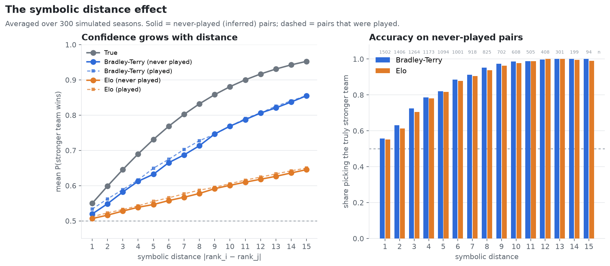

*R3. Accuracy by true rank distance for played and never-played pairs. **What to look at:** the never-played curve rises with distance in both models, from about 55% to about 100%. Compare it with the played curve: in a scalar model, both kinds of pair are read off the same axis.*

### 3.2 Ordering: BT ≈ Elo ≈ win–loss record

At week 10, Spearman's ρ with the true order is about 0.81 for all three. Under a balanced random schedule, strength of schedule roughly averages out across teams. The ordering information is almost entirely in the win counts, so neither model's extra machinery helps with **order**.

This says something about the storage question. Whether you keep only counts, only a running scalar, or the whole history, a balanced schedule gives you the same ranking. The two scalar learners are not distinguishable by rank recovery, which is the measure behavioral TI studies usually report.

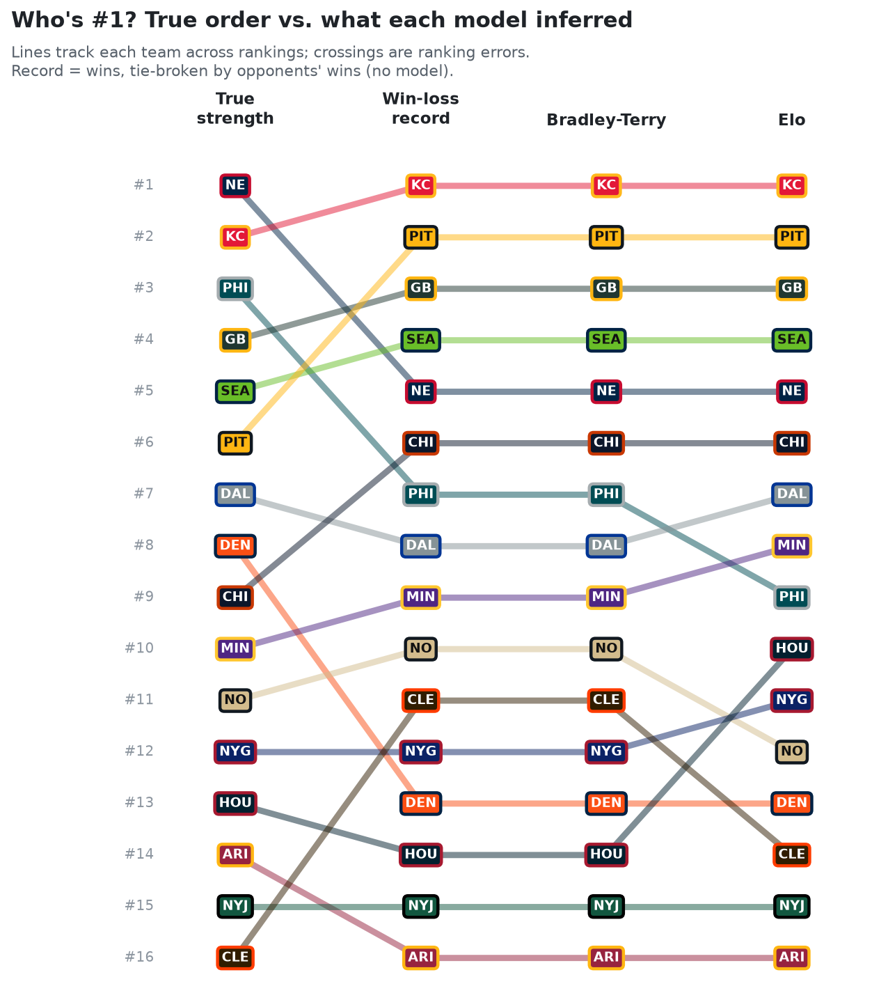

*R4. Estimated rank of each team week by week. **What to look at:** the two models reshuffle teams in similar ways. Check whether the late-season errors are mostly swaps between near neighbors, the 0.55 pairs from C2.*

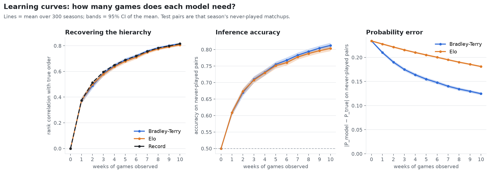

*R5. Rank correlation with the truth across weeks (300 seasons) for BT, Elo, and the win–loss record. **What to look at:** the three curves overlap. On a balanced schedule, ordering does not separate the models.*

### 3.3 Confidence: BT is calibrated, Elo is underconfident

The models differ in the **scale** of the scalar, not its order:

| Week 10, never-played pairs | Bradley–Terry | Elo (K = 20) |
|---|---|---|
| Mean $\lvert \hat P - P_{\text{true}} \rvert$ | 0.125 | 0.18 |
| Calibration (binned by prediction) | well calibrated | strongly underconfident |

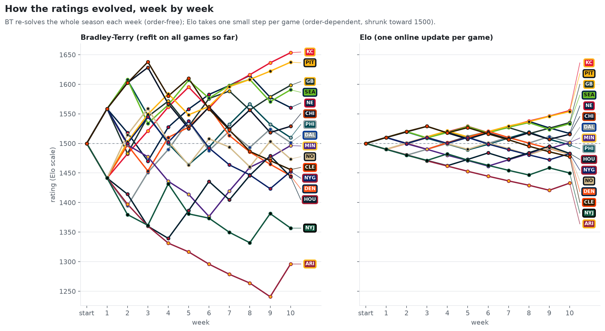

*R6. Rating trajectories across the 10 weeks. **What to look at:** compare how quickly the two models' ratings spread apart. The C5 calculation predicts that Elo's spread is still widening at week 10.*

Why Elo is underconfident (an idealized calculation, not a simulation result). Each game can move a rating by at most $\eta \approx 0.115$ logits, and a typical move is much smaller. For the best team against an average opponent, early in the season $E \approx 0.5$ while the true win probability is about 0.82. The expected drift per game is therefore about $0.115 \times 0.32 \approx 0.04$ logits, and it shrinks as $E$ catches up. Iterating the expected update gives about **0.32 logits (≈ 56 Elo points) after 10 games**, against a true offset of 1.5.

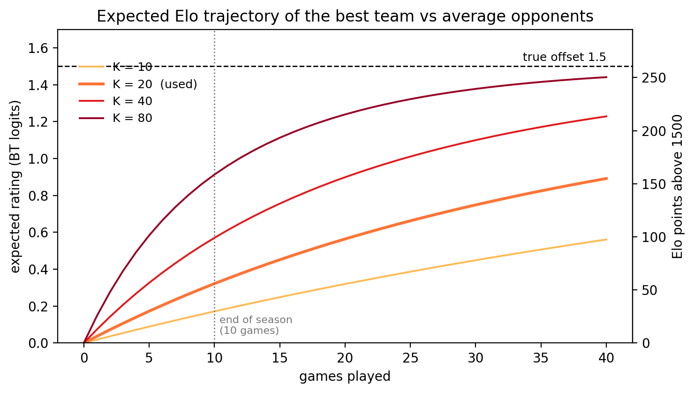

*C5. The expected Elo rating of the best team over games, for several K values, iterating $\Delta v = \eta\,(\sigma(1.5) - \sigma(v))$ against an opponent held at 0. **What to look at:** at K = 20 and 10 games (dotted line), the rating has covered about a fifth of the distance to the truth. The idealization holds opponents fixed, but real opponents also move, so treat the curve as the shape of the effect rather than its exact size.*
 Elo's ratings stay compressed toward 1500, so its predicted probabilities stay compressed toward 0.5. With K = 20 and only 10 games per team, the step size, not the model form, sets the ceiling. The K sweep in Section 6 is the direct check on this explanation.

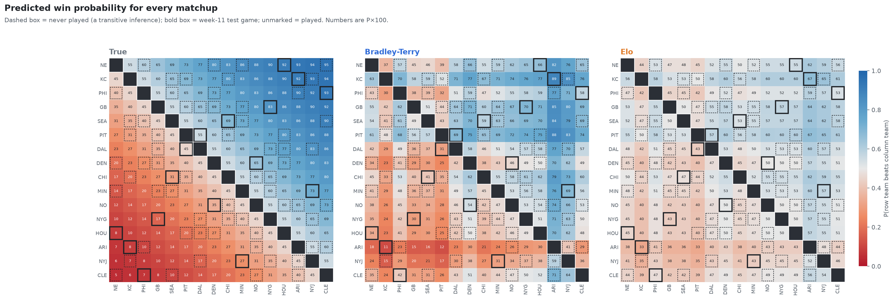

*R7. Predicted P(row beats column) for the truth, BT, and Elo. **What to look at:** all three have the same gradient, since the order is shared. Elo's matrix is washed toward 0.5, BT's sits closer to the truth, and the gap is largest in the far corners.*

BT has no step size. Each refit solves for the values that best explain all games so far, so the scale is limited only by the data and the prior.

### 3.4 BT looks underconfident by true distance, but is calibrated by its own prediction

These two views are not contradictory.

- **Conditioning on the prediction** (bin pairs by $\hat P$ and compare with observed outcomes): BT is calibrated. When it says 0.7, the favored team wins about 70% of the time.
- **Conditioning on the truth** (bin pairs by true rank distance and compare the average $\hat P$ with $P_{\text{true}}$): BT's average prediction sits closer to 0.5 than the truth, because the prior shrinks every $\hat v$ toward 0.

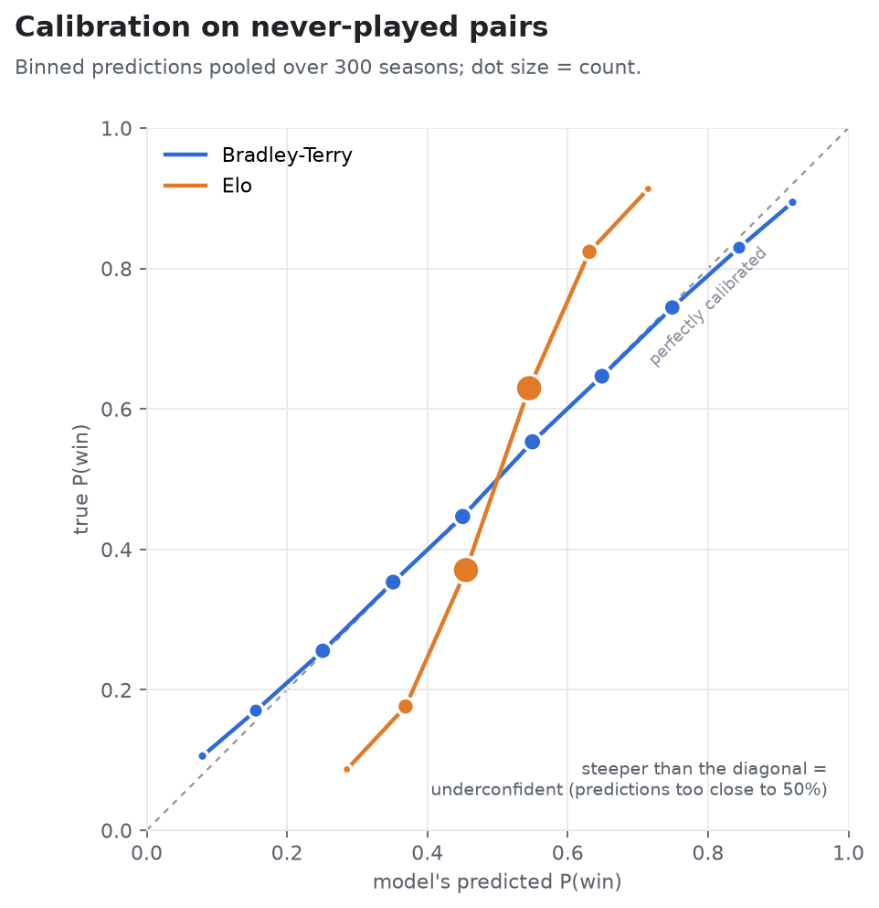

*R8. Calibration on never-played pairs. **What to look at:** when binned by prediction, BT sits on the diagonal and Elo sits steeper than it (outcomes are more extreme than Elo predicts, so Elo is underconfident).*

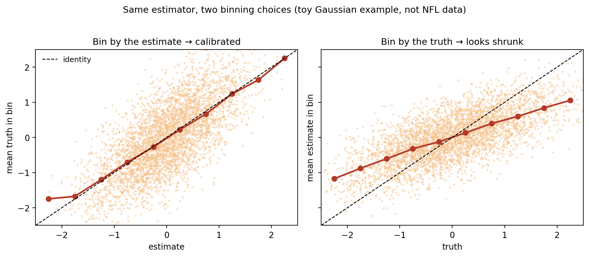

*C6. A textbook Gaussian shrinkage estimator, used here in place of NFL data because the effect is easiest to see there. Binning by the estimate (left) gives the diagonal, which means calibrated. Binning by the truth (right) gives a flatter line, which looks underconfident. The estimator is the same in both panels, and this is the pattern BT shows in 3.4.*

This is the standard signature of a shrinkage estimator: $E[y \mid \hat P] \approx \hat P$, while $E[\hat P \mid P_{\text{true}}]$ is pulled toward 0.5. It matters for how data would be compared to these models. The same learner can look well calibrated or underconfident depending on which variable you bin by.

### 3.5 Week 11 (seed 7)

Four of the eight test games were upsets, and each model got 5 of 8 right. A single week of 8 binary outcomes is dominated by outcome noise. The replicated-season measures above carry the signal, and seed-7 week 11 serves as an illustration only.

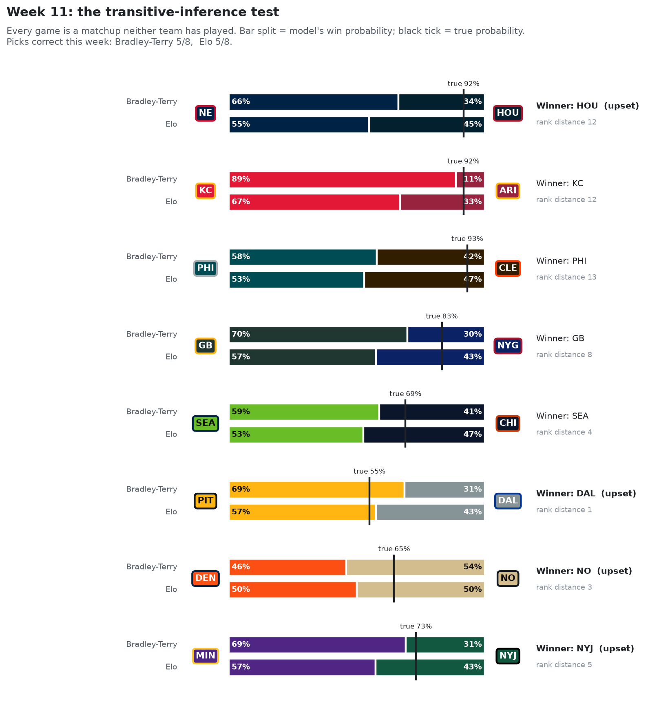

*R9. The eight week-11 games, with each model's predicted probability and the actual outcome.*

---

## 4. Two versions of latent-scalar encoding

BT and Elo agree on both axes: encoding-based, scalar content. Their behavioral difference in this simulation is almost entirely about confidence (3.3), and it traces back to two design choices within "encoding a scalar after feedback."

**(a) What persists between feedback events.** Elo stores only the current ratings. Once a game has updated two ratings, the game itself is discarded. BT keeps the whole record and regenerates the scalar from it. Elo compresses at encoding. BT stores the raw record and treats the scalar as a summary it can recompute. The multi-pass Elo option sits between the two: replaying the season requires keeping the history, which moves Elo toward BT on this dimension.

**(b) How much of the store changes when feedback arrives.** An Elo update touches the two teams in the game. A BT refit can change every team's value: if a team's past opponent loses badly later, the team's own value is revised even though it did not play. This is indirect, global updating, similar in effect to the implicit value updating that Betasort builds in by design (Jensen et al., 2015). In the current sim every team plays every week, so the effect is not isolated. An unbalanced schedule would expose it (Section 6).

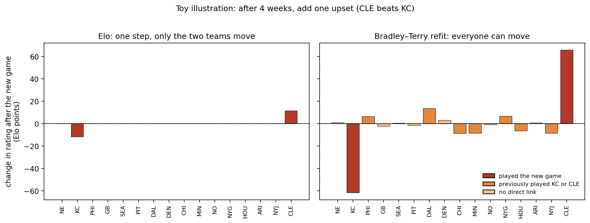

*C4. A toy season, independent of `run_nfl.py`: four random weeks, then one added upset (CLE beats KC). Left: Elo moves only the two teams in the game. Right: the BT refit moves them too, and it also moves teams that had played KC or CLE earlier. Their past results now mean something different. Beating CLE looks more impressive, and losing to KC looks less informative. **Size difference:** BT moves KC and CLE about five times as far as Elo does. With only four prior games per team, one new game is a fifth of BT's evidence, while Elo's step is capped by K. This is the same compression seen in C5.*

One consequence is **order dependence.** Elo is path-dependent: the same set of games in a different order produces different final ratings. BT with a fixed dataset is exchangeable, so order does not matter. This is a behavioral prediction the confidence result does not cover. It is also the one most relevant to human TI learning, where trial order is under experimental control.

So within the scalar family, "encoding after feedback" is not a single mechanism. It covers at least a batch version (store the evidence, refit globally) and an online version (store only the summary, update locally). With a correctly specified model and a balanced schedule, the two versions agree on order and disagree on confidence.

---

## 5. Where this sits in the larger model space

| | **Scalar content** | **Other content** (distribution, graph, conjunctive memory) |
|---|---|---|
| **Encoding** | Bradley–Terry, Elo (this sim) | Betasort (Beta distribution over position) |
| **Retrieval** | — | REMERGE (conjunctive pair memories, recurrent retrieval) |

The simulation fills one cell and varies only the estimator inside it. It cannot test encoding vs. retrieval, because both models are encoding-based. It cannot test what is stored, because the world really is a scalar and both models are correctly specified.

The ring is where the storage question starts to bite. On cyclic data no assignment of scalars fits every edge, and maximum-likelihood BT has no finite solution. Phase 2 models (SR, TEM) do not fit neatly into this 2×2 and are treated separately rather than added as rows.

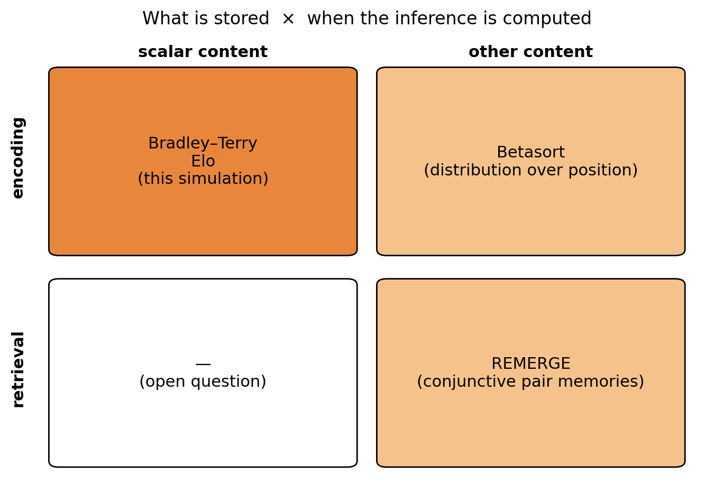

*C7. The two axes as a grid. The simulation lives entirely in the top-left cell.*

---

## 6. Next steps, ordered by which question they address

**Online vs. batch within the scalar cell (Section 4):**
- **Game-order effects.** Shuffle the order of the same season's games and measure the spread in final Elo ratings. BT should show none.
- **K sweep and prior sweep.** Test whether Elo's underconfidence is entirely a step-size effect, and how much of BT's shrinkage the prior sd controls.
- **Elo multiple passes.** Measure how quickly multi-pass Elo converges to BT, and what that costs in storage.
- **Unbalanced schedules** (small τ, clustered). This is where the record and BT should diverge, and where BT's global revision (4b) should show up.

**Stepping out of the correctly specified world (what is stored):**
- **Strength change mid-season.** An online learner should track a change, while a batch refit over the whole history averages across it. Say a quarterback gets injured week 7. For the remaining 3 games, the team struggles. ELO would capture this change for a Week 11 prediction much more accurately than Bradley-Terry would.
- **Non-additive world.** Generate outcomes that no scalar can fit, such as intransitive triads, and look at how each model fails. This is the bridge to the ring.
- **Terminal-item analysis.** Check whether the scalar models show the end-item advantage purely from having fewer opponents above or below. This connects to the α estimate from Lippl et al. (2024).

---

## References

- Bradley, R. A., & Terry, M. E. (1952). Rank analysis of incomplete block designs: I. The method of paired comparisons. *Biometrika*, 39(3/4), 324–345.
- Elo, A. E. (1978). *The Rating of Chessplayers, Past and Present.* Arco.
- Jensen, G., Muñoz, F., Alkan, Y., Ferrera, V. P., & Terrace, H. S. (2015). Implicit value updating explains transitive inference performance: The betasort model. *PLoS Computational Biology*, 11(9), e1004523.
- Kumaran, D., & McClelland, J. L. (2012). Generalization through the recurrent interaction of episodic memories: A model of the hippocampal system. *Psychological Review*, 119(3), 573–616.
- Lippl, S., Kay, K., Jensen, G., Ferrera, V. P., & Abbott, L. F. (2024). A mathematical theory of relational generalization in transitive inference. *PNAS*, 121(28), e2314511121.
