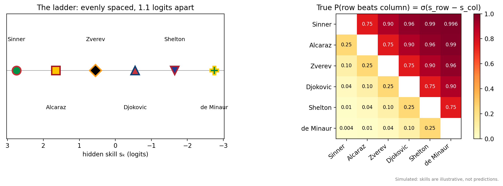
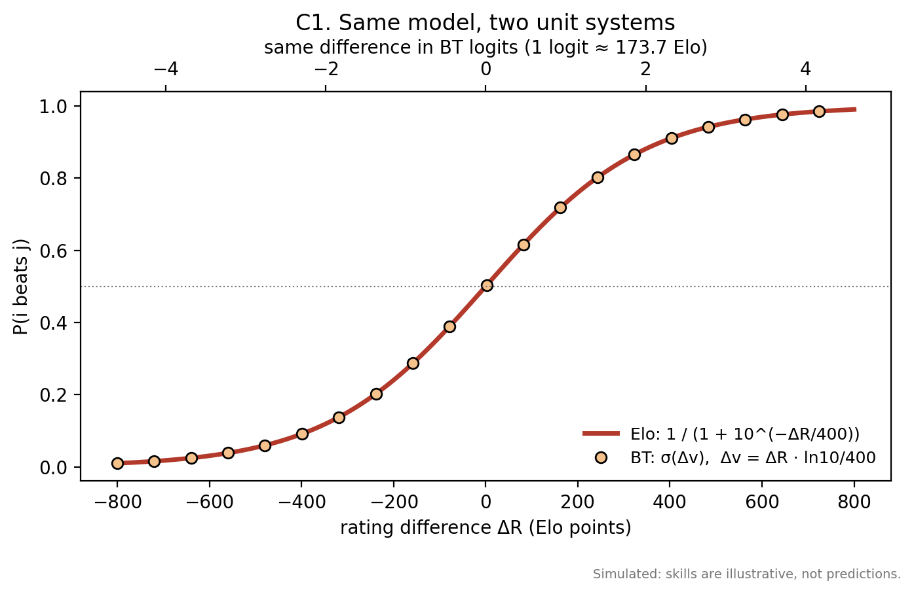
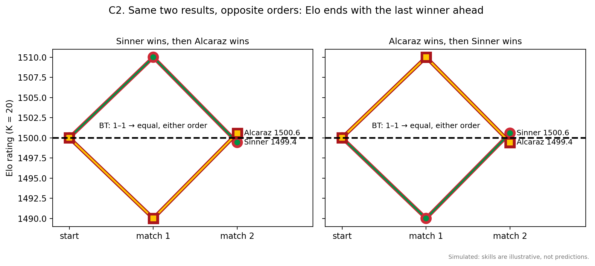
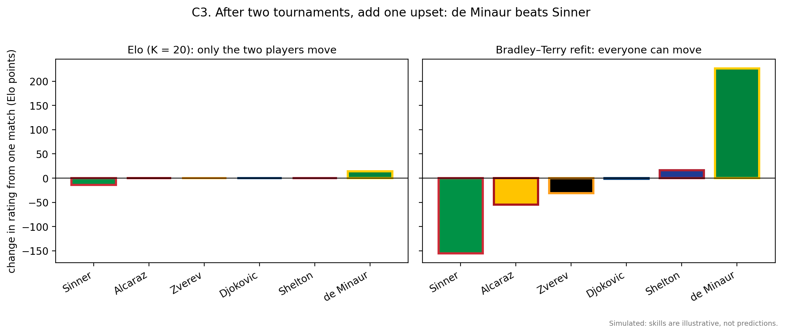
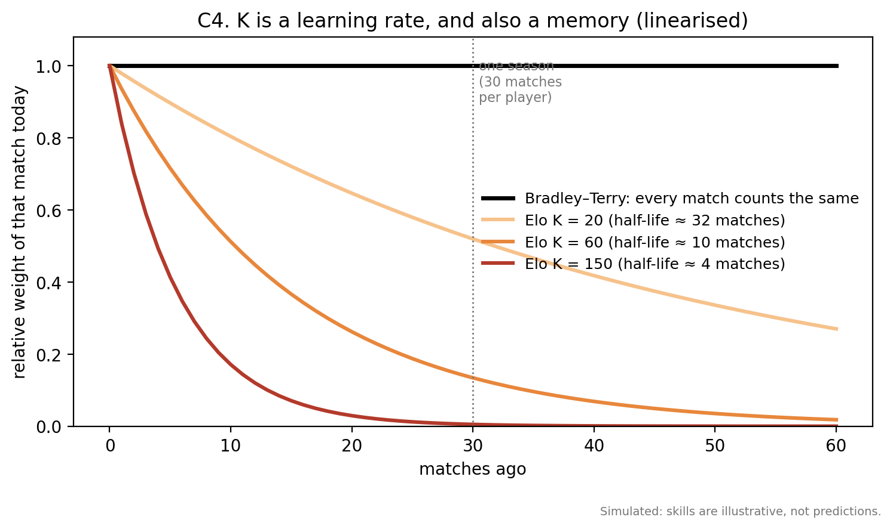
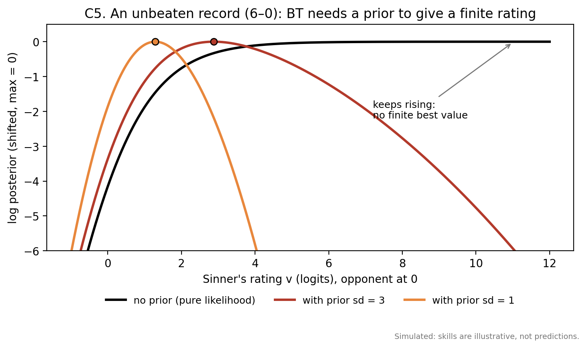
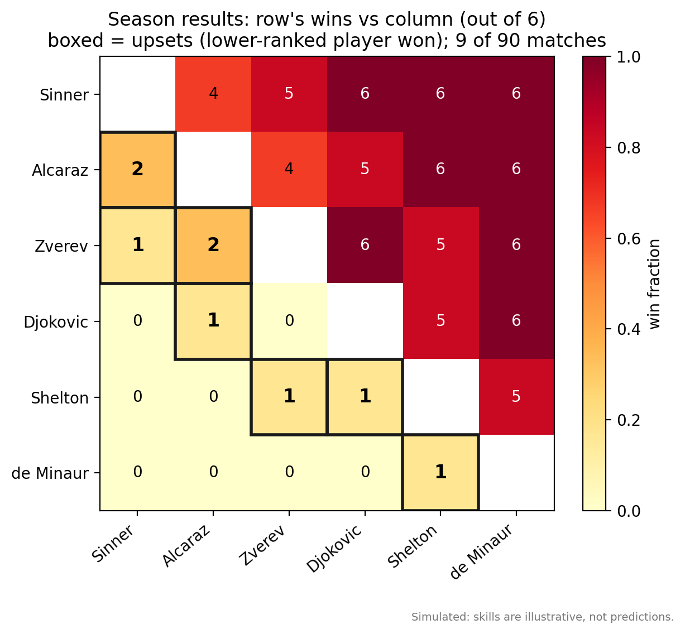
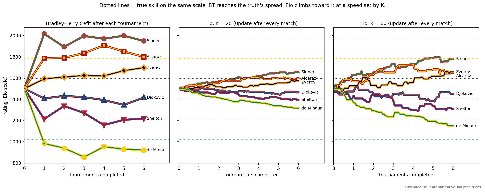
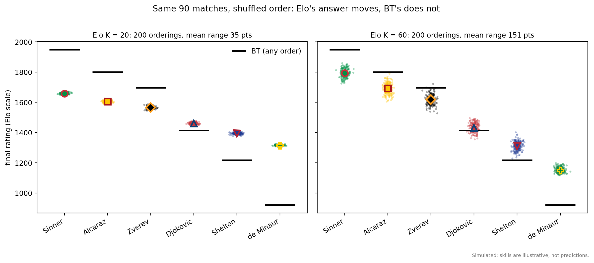
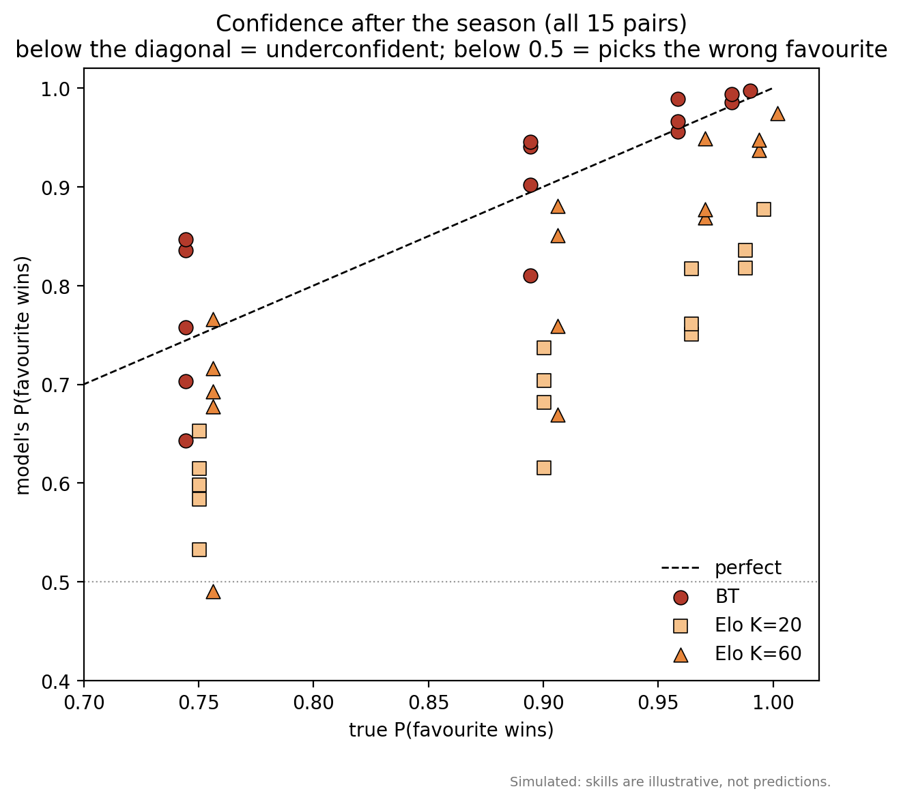

# tennis_sim: Bradley–Terry vs Elo, taught on a tennis tour

_Part of `ti-models`. A small, readable simulation for teaching the two latent-scalar models before moving to transitive inference (TI) proper._

> **The players are real, the results are not.** Skills are illustrative, not predictions.

```
tennis_sim/
├── README.md             ← this file
├── run_tennis.py         ← the simulation: world, both models, result figures 01–05
├── concept_figures.py    ← teaching figures C1–C5 (imports models from run_tennis.py)
├── figures/
└── results/summary.txt   ← numbers quoted below
```

Run from inside `tennis_sim/` (outputs go to `figures/` and `results/` relative to where you run):

```bash
cd tennis_sim
python run_tennis.py
python concept_figures.py
```

Needs only `numpy` and `matplotlib`. Seed 11 reproduces every number here.

---

## 0. Why tennis

Tennis is a clean fit for these models:

- **Binary outcomes.** One player wins, one loses, and there are no ties or scores.
- **Repeated matchups.** The same opponents meet again and again, so there is plenty of evidence per pair.
- **Honest framing.** Elo is actually used to rate tennis players.

Two figure types appear below. **Concept figures (C1–C5)** each explain one idea with a worked example or a closed-form calculation. **Result figures (01–05)** come from one simulated season.

---

## 1. The world

Six players with hidden skills, evenly spaced **1.1 logits** apart, in this order:

**Sinner > Alcaraz > Zverev > Djokovic > Shelton > de Minaur**

$$
s_k = 1.1\,(2.5 - k), \qquad k = 0, \dots, 5 \qquad (+2.75 \text{ down to } -2.75)
$$

$$
P(i \text{ beats } j) = \sigma(s_i - s_j) = \frac{1}{1 + e^{-(s_i - s_j)}}
$$



*01. Left: the hidden ladder. Right: the true win probabilities. **What to look at:** upsets are rare but real. Neighbors are 75/25. Two rungs apart is 90/10, and the top vs. the bottom is 99.6/0.4. Probability grows with rank distance. That's the symbolic distance effect, and here it is built into the world itself.*

**The schedule** is six tournaments. Each is a full round robin: 15 matches, played in random order. That makes 90 matches in total, 30 per player, and 6 meetings per pair.

**Colors** follow each player's flag, with the line or marker fill in one flag color and an outline in the second:

| Player | Country | Fill / outline | Marker |
|---|---|---|---|
| Sinner | Italy | green / red | ● |
| Alcaraz | Spain | yellow / red | ■ |
| Zverev | Germany | black / orange | ◆ |
| Djokovic | Serbia | red / blue | ▲ |
| Shelton | USA | blue / red | ▼ |
| de Minaur | Australia | green / gold | ✚ |

Every line also carries a name label, so no one has to rely on color alone.

---

## 2. The two models

Both models assume the same outcome rule as the world, $\sigma(v_i - v_j)$. They are **correctly specified**, so every difference below comes from *how they estimate*, not from what they believe.

### 2.1 Bradley–Terry: batch

Keep every match. After each tournament, refit all the ratings at once to explain all matches so far.

$$
\ell(\mathbf v) = \sum_{\text{matches}} \log \sigma(v_{\text{winner}} - v_{\text{loser}}) \;-\; \sum_k \frac{v_k^2}{2\tau^2}, \qquad \tau = 3
$$

The fit uses Newton's method, with the gradient and Hessian written out in `fit_bt()`. The Gaussian prior (sd τ = 3) keeps an unbeaten player's rating finite (C5). It's wider than the NFL sim's τ = 1, because this world spans 5.5 logits.

### 2.2 Elo: online

Update after every match, then throw the match away.

$$
E_w = \frac{1}{1 + 10^{(R_l - R_w)/400}}, \qquad R_w \mathrel{+}= K(1 - E_w), \qquad R_l \mathrel{-}= K(1 - E_w)
$$

Everyone starts at 1500. We run **K = 20** and **K = 60** side by side. Only the two players in a match move (`run_elo()`).

### 2.3 Side by side

| | Bradley–Terry | Elo |
|---|---|---|
| Stores between matches | every result so far | one number per player |
| Updates | after each tournament | after each match |
| Who moves | everyone (global refit) | the two players in the match |
| Order of matches matters? | no | yes |
| Tuning knob | prior sd τ | step size K |

---

## 3. The fundamentals, one idea at a time

### 3.1 Same model, two unit systems



*C1. Elo's expected-score formula and BT's logistic are the same curve. The only difference is the units: $10^{x/400} = e^{x \ln 10/400}$, so 1 BT logit ≈ 173.7 Elo points.*

The Elo update is one gradient step on the BT log-likelihood for a single match:

$$
\frac{\partial}{\partial v_w} \log \sigma(v_w - v_l) = 1 - \sigma(v_w - v_l) = \text{outcome} - \text{expected}
$$

That's a prediction error. **Elo is Bradley–Terry learned one match at a time**, with K as the learning rate. It's also why Elo belongs to the same family as Rescorla–Wagner.

### 3.2 Batch vs. online: order matters to Elo



*C2. Sinner and Alcaraz split two matches. BT sees 1–1 and calls them equal, whichever order the matches came in. Elo ends with whoever won last ahead, at 1500.6 vs. 1499.4. The results are the same and the order is reversed, so the answer flips.*

This is the smallest possible demonstration of the batch vs. online difference. BT depends on the **set** of results, and Elo depends on their **sequence**. Figure 04 shows the same effect on a full season.

### 3.3 Global vs. local: who moves after one match



*C3. After two tournaments, add one upset: de Minaur beats Sinner. Elo moves exactly two players, by 14 points each. The BT refit moves de Minaur up 227 and Sinner down 156. It also moves players who weren't in the match: Alcaraz and Zverev drop, and Shelton rises.*

BT reinterprets *old* results in light of the new one. De Minaur now looks better, so earlier wins over him are worth less. Sinner now looks worse, so earlier losses to him are more costly. Every player whose earlier results involved Sinner or de Minaur gets re-scored, which is why Alcaraz, Zverev, and Shelton move even though they didn't play. The same idea, updating players who weren't in the match, is built into Betasort by design (Jensen et al., 2015).

The size gap matters too. De Minaur was 0–10, so BT had him far down, and one win is a big share of his evidence. Elo's step is capped by K.

### 3.4 K is a learning rate, and also a memory



*C4. How much a match from n matches ago still counts today. BT weights every match equally. Elo's weights fade, with half-lives of roughly 32 matches at K = 20, 10 at K = 60, and 4 at K = 150. This is a linearized approximation around a 75% favorite.*

Elo stores no history, but its rating behaves like a **fading average of past results**, and K sets how fast they fade. At K = 20 the memory is longer than the whole season, so Elo is still climbing away from its 1500 starting point when the season ends (figure 03). A larger K reaches the truth faster but reacts more to every upset. That's the bias–variance tradeoff.

### 3.5 The unbeaten player: why BT needs a prior



*C5. A 6–0 record against one opponent. Without a prior, the likelihood keeps rising as the rating grows, so there's no finite best value. With prior sd 3, the best value is 2.9 logits. With sd 1 it's 1.3, which would squash this world's 5.5-logit spread.*

With rare upsets, unbeaten records happen, and the prior is what handles them. Elo never faces this problem, because each step is bounded. It just keeps climbing slowly.

---

## 4. One season: what the models learned

### 4.1 The data



*02. Wins out of 6 for each pair. Boxed cells are upsets: **9 of 90 matches**, all within two rungs of the ladder. Sinner went 27–3 and de Minaur went 1–29.*

### 4.2 Ratings over the season



*03. The same season through three learners on one Elo-scale axis, with dotted lines for the true skills. **What to look at:** BT spreads the players to about the true scale after the first tournament, and then mostly fine-tunes. Elo at K = 20 is still packed tightly around 1500 after 90 matches. At K = 60 it gets much closer to the truth, but the lines are jumpier, and in this match order Zverev finishes a few points above Alcaraz.*

| Player | True | BT | Elo K = 20 | Elo K = 60 | Record |
|---|---|---|---|---|---|
| Sinner | 1978 | 1950 | 1656 | 1780 | 27–3 |
| Alcaraz | 1787 | 1800 | 1597 | 1651 | 23–7 |
| Zverev | 1596 | 1698 | 1574 | 1658 | 20–10 |
| Djokovic | 1404 | 1415 | 1464 | 1452 | 12–18 |
| Shelton | 1213 | 1217 | 1395 | 1310 | 7–23 |
| de Minaur | 1022 | 920 | 1314 | 1149 | 1–29 |

BT is not perfect. It overrates Zverev, whose results included wins over Sinner (once) and Alcaraz (twice), and it underrates de Minaur, who went 1–29. But these are errors in the *data*, which BT reads faithfully. Elo's errors come mostly from its *step size*.

### 4.3 Same matches, different order



*04. The same 90 matches, re-ordered 200 times. Each dot is Elo's final rating for one ordering, and the black bar is BT's single answer. **What to look at:** BT doesn't move. Elo's final ratings spread over about 35 points at K = 20 and 151 points at K = 60. At K = 60, Alcaraz and Zverev overlap, so the order of play can decide which one Elo ranks higher.*

This is C2 at the scale of a season. A larger K makes Elo more sensitive to recent matches, which also makes it more sensitive to their order.

### 4.4 Confidence



*05. Predicted vs. true win probability for all 15 pairs. **What to look at:** BT scatters around the diagonal. Elo at K = 20 sits well below it, so its predictions are underconfident. K = 60 is closer. One K = 60 point falls below 0.5: Elo picks the wrong favorite in Alcaraz vs. Zverev.*

Mean |P − P_true|: **BT 0.038, Elo K = 20 0.176, Elo K = 60 0.079.**

### 4.5 In one sentence

With the same model and the same matches, BT gives an answer that doesn't depend on match order and is on roughly the right scale. Elo gives an answer that depends on the order, is compressed by default, and has its speed, noise, and memory all set by K.

---

## 5. How this connects to transitive inference

### 5.1 The mapping

| Tennis | TI experiment |
|---|---|
| player | item (A, B, C, …) |
| hidden skill | position in the hidden order |
| match | premise-pair trial |
| winner | the rewarded choice |
| rating | the item's learned value |
| Elo update | prediction-error learning (the Rescorla–Wagner family) |
| BT refit | an ideal observer fitting all trials so far |
| probability rising with rank gap | symbolic distance effect |

Read this way, **BT and Elo are value-learning models of TI.** Each item gets one number, and a choice compares two numbers. This is the value side of the field's central split: value or scalar accounts (RW, BT, Elo, Betasort) vs. relational or memory accounts (REMERGE, and beyond them SR and TEM).

### 5.2 Where these models sit on the two axes

The NFL write-up ([`../latent_scalar_sim/README.md`](../latent_scalar_sim/README.md)) separates two questions:

1. **When is the inference computed?** Both models do it at encoding. Each result updates the stored values, and a judgment is only a readout, $\sigma(v_i - v_j)$. Nothing is chained together at test.
2. **What is stored?** Both models store a scalar per item, which assumes the items fall on one line: a strict total order.

So this simulation compares two versions of the *same* cell: encoding-based and scalar. What it isolates is the estimator. Batch vs. online, global vs. local updating, and remembering vs. forgetting are all differences *within* value learning.

A connection worth naming is Lippl et al. (2024). Their minimum-norm solution for a network trained on TI has the form $f(i,j) = r_i - r_j$, which is the same decision variable as BT. BT **assumes** the scalar. Lippl et al. show it can **emerge** as the efficient solution when a network learns a linear order.

### 5.3 What this simulation deliberately leaves out

- **No inference test.** Every pair plays in a round robin, so nothing has to be inferred. A standard TI design trains only adjacent pairs and tests the rest. That's where the scalar does real work, by producing answers for pairs that never met.
- **No violation of the total order.** The world here is truly one-dimensional, so a scalar is the right thing to store. The next step breaks that.

### 5.4 Next: surfaces (not yet implemented)

Give players surface specialties, so that a player strong on clay can be weak on grass. Then it becomes possible that A beats B on clay, B beats C on grass, and C beats A on hard courts. **No single number per player fits these results.** Both models have to average the contradictions away.

This is the tennis version of the ring. On a ring there is no consistent ranking at all, and maximum-likelihood BT on cyclic data has no finite solution. Surfaces are the point where "what is stored" stops being a scalar question and turns into the question our ring-structure experiment is built to answer.

---

## References

- Bradley, R. A., & Terry, M. E. (1952). Rank analysis of incomplete block designs: I. The method of paired comparisons. *Biometrika*, 39(3/4), 324–345.
- Elo, A. E. (1978). *The Rating of Chessplayers, Past and Present.* Arco.
- Jensen, G., Muñoz, F., Alkan, Y., Ferrera, V. P., & Terrace, H. S. (2015). Implicit value updating explains transitive inference performance: The betasort model. *PLoS Computational Biology*, 11(9), e1004523.
- Kumaran, D., & McClelland, J. L. (2012). Generalization through the recurrent interaction of episodic memories: A model of the hippocampal system. *Psychological Review*, 119(3), 573–616.
- Lippl, S., Kay, K., Jensen, G., Ferrera, V. P., & Abbott, L. F. (2024). A mathematical theory of relational generalization in transitive inference. *PNAS*, 121(28), e2314511121.
- Rescorla, R. A., & Wagner, A. R. (1972). A theory of Pavlovian conditioning. In *Classical Conditioning II* (pp. 64–99). Appleton-Century-Crofts.
